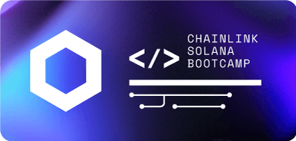
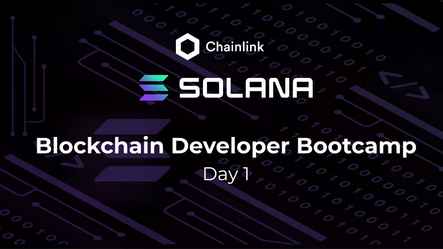
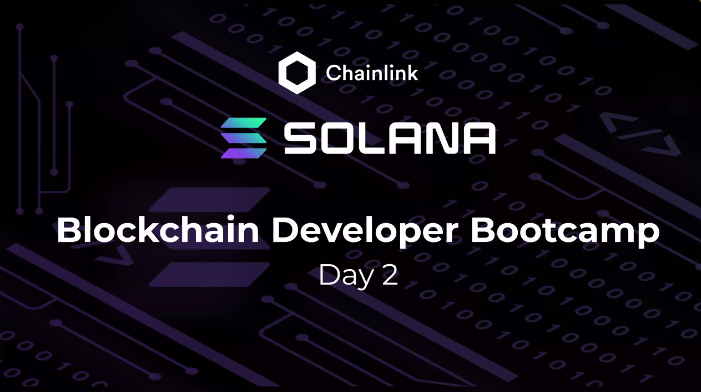

<!--  -->

# <b> Chainlink x Solana 2022 Bootcamp </b>

2022 Technical Blockchain Developer Bootcamp program put on by the Chainlink DevRel Team to educate on the fundamental building blocks of building dapps on the Solana blockchain, using Rust as the smart contract programming language, and implementing Chainlink's verifiable oracle networks to verify and validate off-chain data on-chain on the blockchain.

## Tech Stack:

- **Rust:** smart contract programming language
- **TypeScript/JavaScript:** running the dapp
- **Anchor:** framework for Solana abstraction
- **Chainlink:** Oracle network for off-chain data verification

<!--  -->

# Part 1: Introduction

## Key Learnings:

- Rust as a programming language for smart contracts
- Solana as a computationally efficient, fast, and secure public blockchain network
- Using the Solana CLI to build a token-based dapp
- Learning Solana's value proposition, as explained by CEO Anatoly Yakavenko on "chewing glass":
  - why is there transaction size limit?
  - why do we have to specify all the accounts for every smart contract call?
  - why do we have to code with no global memory?
  - why not make a computationally efficient blockchain network that solves all of these current issues (Solana)?
- Key benefits to Solana:
  - open-sourced, permissionless, decentralized
  - Approximately 1,500 nodes capable of 50k TPS
  - BFT PoS consensus mechanism
  - "Proof of History" to maintain state
  - No mempool - uses "Gulf-Stream" to forward transactions to future 'leaders'
  - Clients/off-chain dapps communicate with on-chain Solana programs with the JSON RPC API or an API-compatible SDK

## Projects Built:

- GM App: [`gm-program`](gm-program)
- Token Program [`token-program`](token-program)

<!--  -->

# <b>Part 2: Anchor & Chainlink</b>

## Key Learnings:

- Using the Project Serum Anchor Framework to build Solana dapps
- How Solana smart contracts are deployed as "Data Files" and these data files receive SOL to run compute (compared to the EVM-compatible frameworks where a wallet "does work to" or "on behalf of" a smart contract)

## Projects Built:

- GM App (with Anchor Framework): [`gm-anchor`](gm-anchor)
