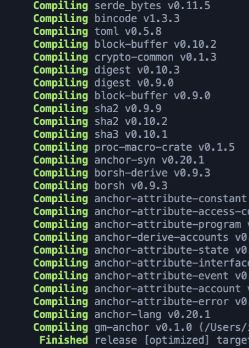

# GM App with the Anchor Framework

For today's 1st dapp, we built a GM App using @rustlang, @solana, and the @ProjectSerum Anchor Framework at @chainlink's Technical Bootcamp today 👨‍💻

### The client running with the smart contract:

I ended up learning way more about SOL & Anchor than I expected, so here's some notes!

To get this running, we'll spin up a localhost @solana network and then run our solana-test-validator, which will initialize and then get us a RPC URL endpoint that we can connect to locally:

Then using the @ProjectSerum Anchor Framework, we will build a wrapper for our project with a few folders:
📁 app: where client.js will go
📁 programs/gm-anchor: will include the /src/lib.rs file
📁 target: what will get generated later when we run it
🧾 id.json: account

You will then use a few commands to get the project launched: `anchor build` - takes our Rust code & packages it up `anchor deploy` - publishes it to our local network

To run:

`node client.js --program $(solana address -k ../target/deploy/gm_anchor-keypair.json) --name Brian`

❌ However, initially, I was getting an error:

    "TypeError [ERR_INVALID_ARG_TYPE]: The "path" argument must be of type string or an instance of Buffer or URL. Received undefined"

What I learned was that my ENV VAR was off for specifying the ANCHOR_WALLET='../id.json'

What was interesting was that for this @solana project, the program you deploy needs to have SOL for it to run.

This is a bit different from Solidity where the wallet itself needs ETH to run a contract (on behalf of the wallet/user).

In SOL, programs/contracts are data files.

✅ So to fix this error, I needed to make sure that the wallet for the contract "ANCHOR_WALLET" received 2 testnet SOL files

`solana airdrop 2 $(solana-keygen pubkey ./id.json)`

^ this is the Anchor 'provider` that will run the contract, so it needs SOL to do that.

You can test the amount of SOL in the wallet with: `solana balance`

The full command to test this was: `solana balance ../target/deploy/gm_anchor-keypair.json` when inside of the /app folder to ensure the amount of SOL is there.

^ I found there was no SOL in the programId 😱

❌ This was leading to another error:

"SendTransactionError: failed to send transaction: Transaction simulation failed: Attempt to debit an account but found no record of a prior credit."

This was also because of the wrong ENV VAR that was set for the account calling it

✅ When we know there is SOL in our `id.json' file in the root folder of `gm-anchor`, we can then do:

`export ANCHOR_WALLET='../id.json'`

This will work because... when we run our /app/client.js file, the anchor provider will look for the address/account in /gm-anchor with SOL

Coming from the Solidity world, it was different to think of the crypto referenced in a file within a program, rather than a wallet that runs a program on the wallet's behalf.

This was a pretty cool lesson and am super grateful for @pappas999 @ZakAyesh's help walking through this with me!!

...by ensuring the account that was referenced by my app had the right amount of SOL to then run the transaction and print 'GM Brian'!

Oftentimes, debugging/breaking code is how you learn the fastest...at least for me...even if you go slowly and (chew glass along the way) 😊
