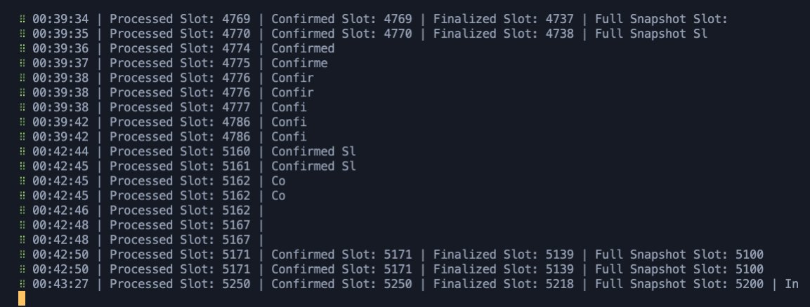
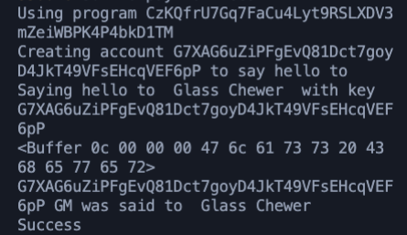

# GM App
gm @rustlang && @solana && @typescript! 🚀 Just wrote my 1st dapp using Rust, and Solana at  
@chainlink's Technical Bootcamp today 👨‍💻

Learned about serializing and deserializing bytecode using Borsh and web3js to update the state:

### Local Solana testnet running:

### The program after running:
