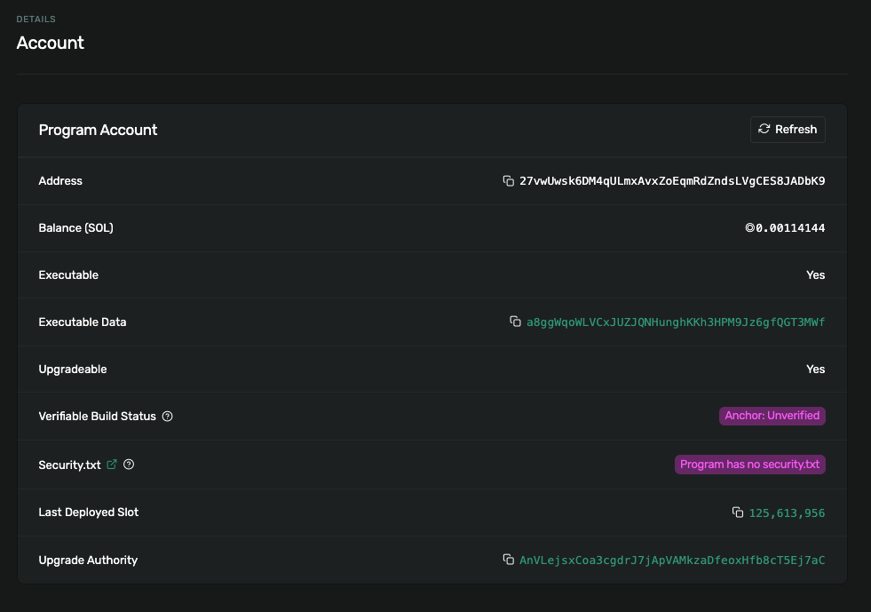
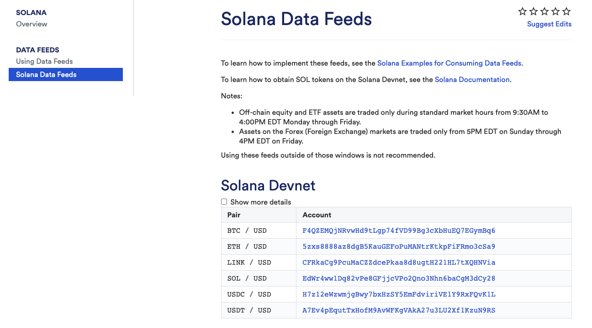
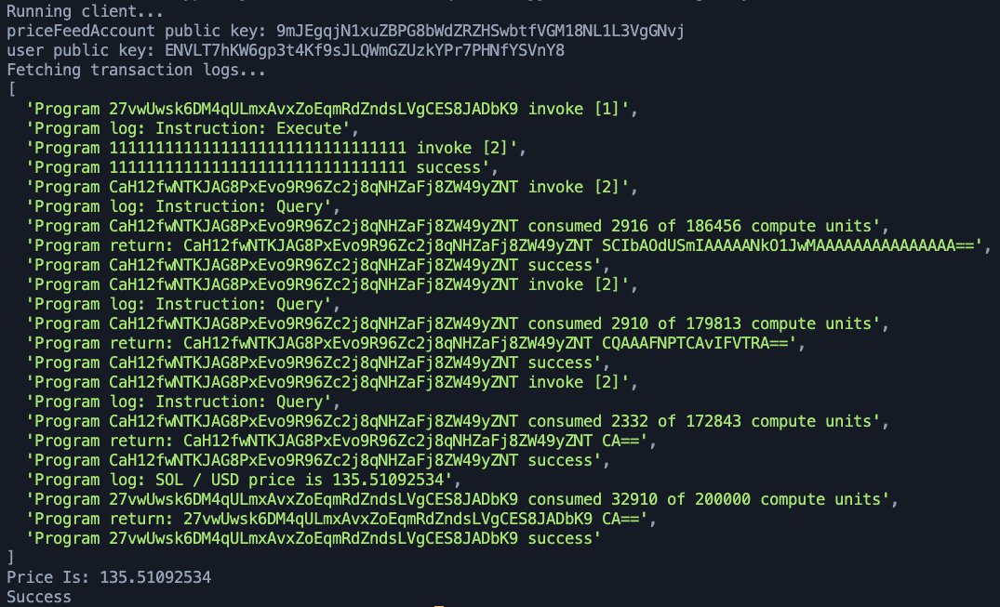
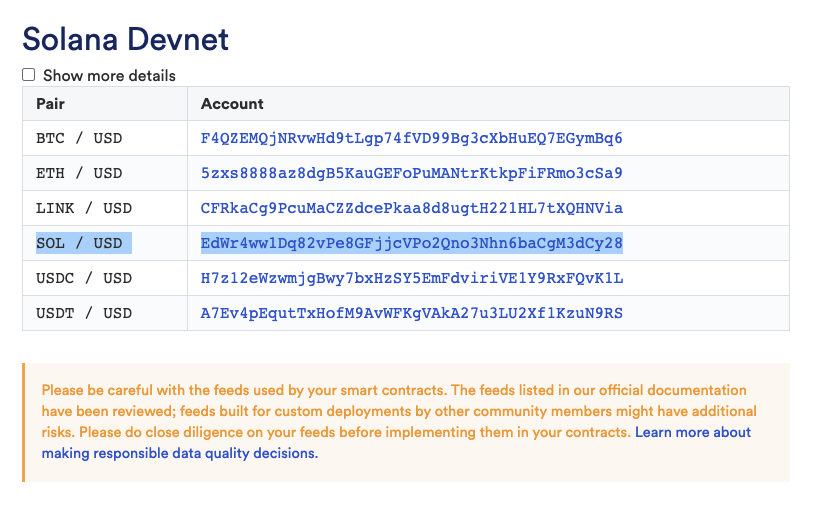
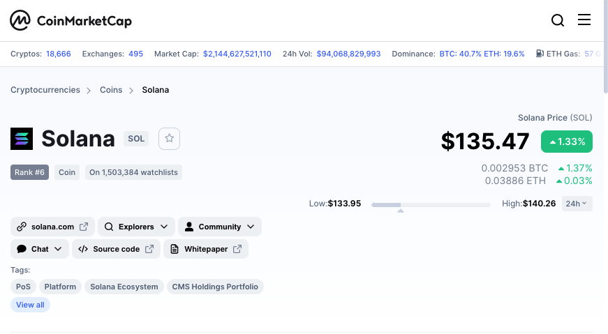
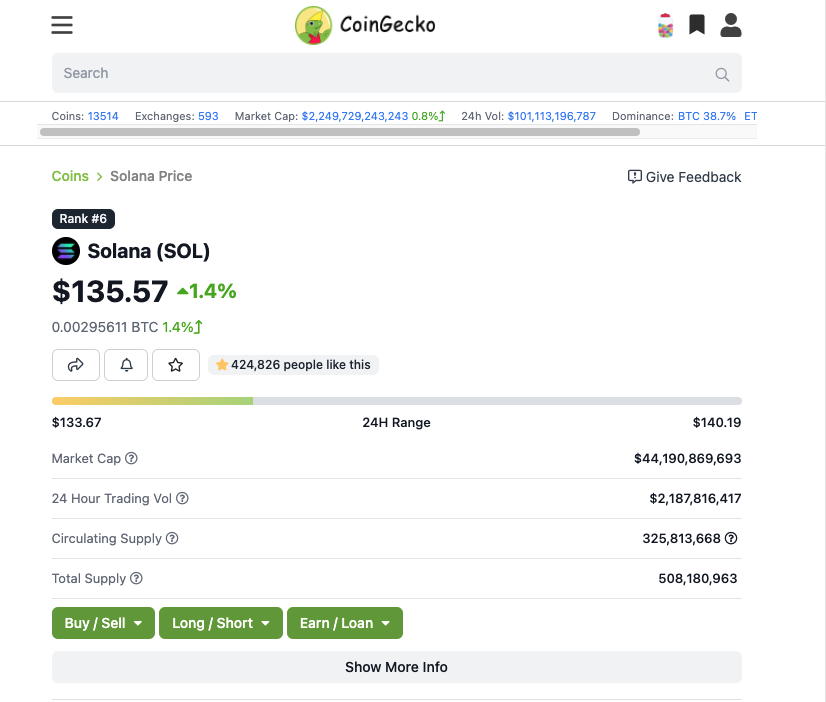
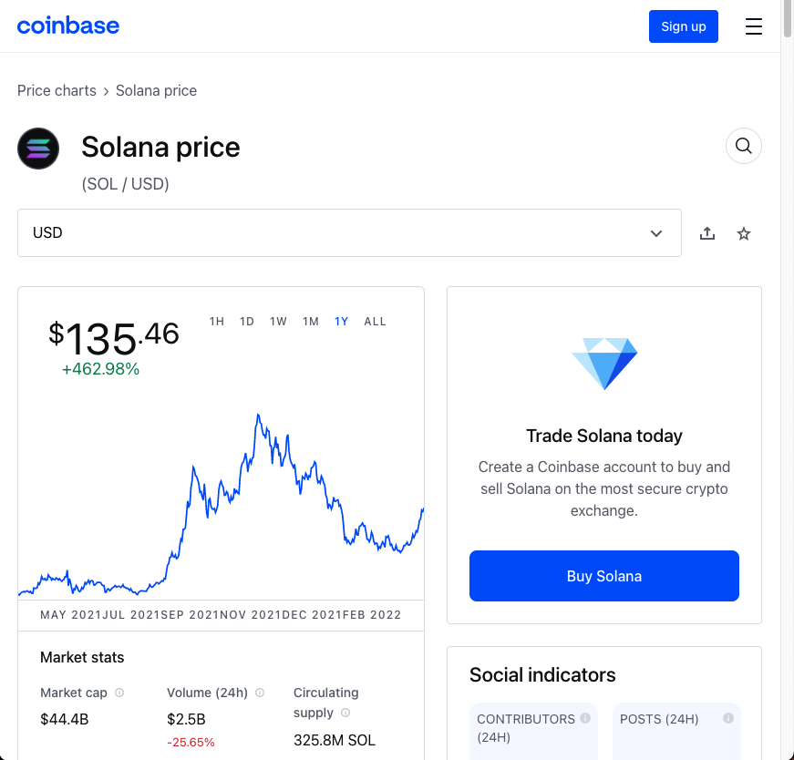
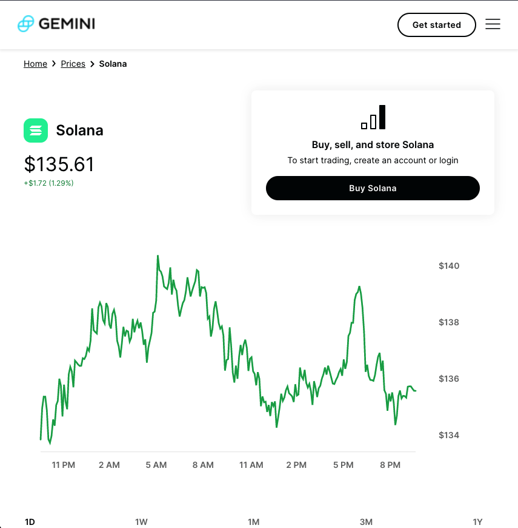

# Chainlink Price Feeds Consumer

## Description:

Create, deploy and interact with a Solana program that will consume data from a Chainlink Data Feed. The program will take an account (to store the price data), and a Chainlink Data Feed account, then it will read the latest price from the data feed, and store the value in the first account.

Chainlink Solana Crate:

- Link: https://crates.io/crates/chainlink_solana
- Version: `chainlink_solana = "0.1.1"`

# Solana Blockchain Verification:

### Rust Smart Contract Deployed to Solana DevNet:

- Link: [Solana DevNet](https://explorer.solana.com/address/27vwUwsk6DM4qULmxAvxZoEqmRdZndsLVgCES8JADbK9?cluster=devnet)
- Screenshot:
  

# Chainlink Solana Data Feeds:

- Link: [Chainlink Solana Data Feeds](https://docs.chain.link/docs/solana/data-feeds-solana/)
- Screenshot:
  
- I selected: SOL / USD Account: [EdWr4ww1Dq82vPe8GFjjcVPo2Qno3Nhn6baCgM3dCy28](https://solscan.io/account/EdWr4ww1Dq82vPe8GFjjcVPo2Qno3Nhn6baCgM3dCy28?cluster=devnet)

# Running the dapp:

⛓ For the final dapp of the
@chainlink Bootcamp, we built a @solana program that takes an account (to store price data), and a Chainlink Data Feed account...and then reads the latest price from that feed to store it in the 1st account:

### Pulling from the Chainlink / SOL data feed:

Thanks to @chainlink's data feeds, we have several options to pick from — I chose to pull the price data from the SOL/USD Data Feed:

SOL / USD
EdWr4ww1Dq82vPe8GFjjcVPo2Qno3Nhn6baCgM3dCy28

Link: https://docs.chain.link/docs/solana/data-feeds-solana/

When we run our client file with our smart contract, and we see:

    Price Is: 135.51092534

Which is interesting b/c these 4 websites (@CoinMarketCap, @coingecko, @coinbase, @Gemini) each report 4 different prices for @solana at the same time I ran my smart contract...

So who is right?

This is the case of the Oracle Problem & @chainlink provides a framework to fix this:

⛓ To allow off-chain data to be verified in a deterministic way (something that the blockchain natively cannot do).

⛓ To get external data/computation into smart contracts!

Further, @chainlink brings with it a decentralized Oracle Network, run & operated by independent & sybil resistant node operators to reach consensus (agreement) about a certain data, item, or computation.

This is how we can get one @solana price in our @rustlang smart contract!

