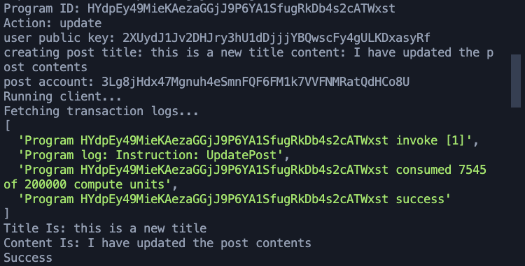
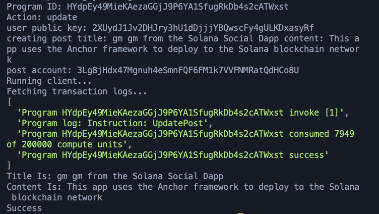
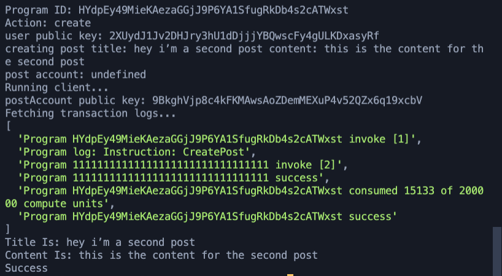
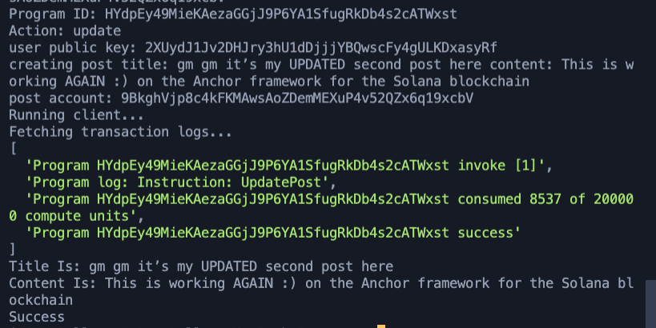

# Social Social Media App

📲 For dapp #2, we built a social media app with @rustlang, @solana, and the @ProjectSerum Anchor Framework at today's @chainlink bootcamp!

Each of our posts gets a `postAccount public key` which we can use to update the posts!

# Post #1:

## Before:

## After:

# Post #2

## Before:

## After:

# Documentation:

In Rust, we specify each of the params of what we can do:

📝 Create a Post with a title (50 chars max) and a content field (280 chars max)

♻️ Update a Post with the same as the above

We will then look for that Account as the signer and publish the post with it's own public key

We will use the post's accountPublicKey:

node client.js --program $(solana address -k ../target/deploy/solana_social-keypair.json) --action update --title "updatedTitle" --content "updatedContent :) on the Anchor framework for the Solana blockchain" --post 12345abcdef...

✨ VIOLA ✨ - users can update their posts and it can happen right on the verifiable blockchain with Solana thanks to the @ProjectSerum Anchor Framework - abstracting so much of the technical serialization/deserialization work that you would need to do on Solana by yourself.
