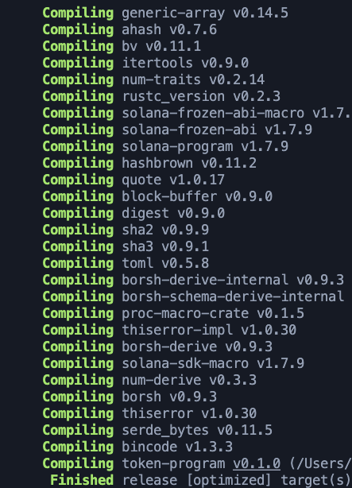

# Solan SPL Token Dapp

2nd dapp built using @rustlang,  @solana, and @typescript at @chainlink's Technical Bootcamp today 👨‍💻

Learned about accounts, token addresses, Borsh, rent, and how to update the state of a Solana blockchain network.

It's pretty cool to see how the blockchain works and updates it's state with snapshots when you do writes to the chain by updating accounts and serializing/deserializing data to the network 🤩

### The Solana local testnet running:

### The program running on the Solana local testnet:

